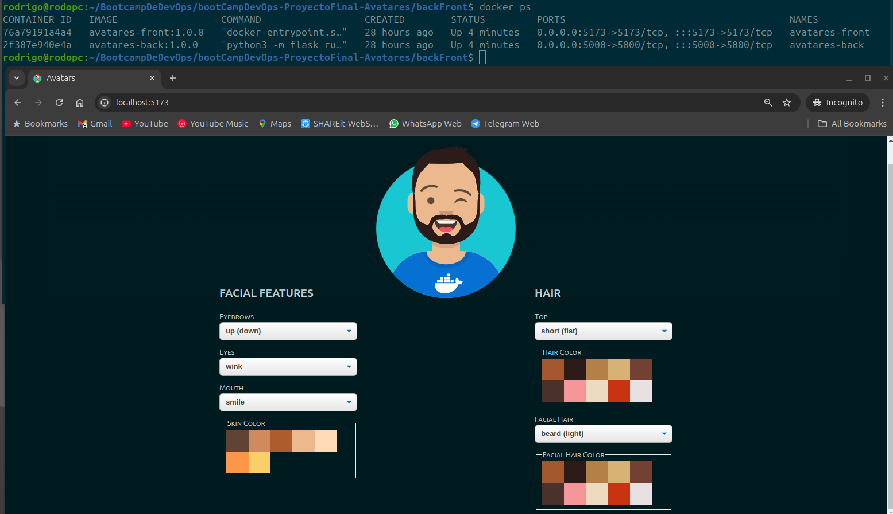
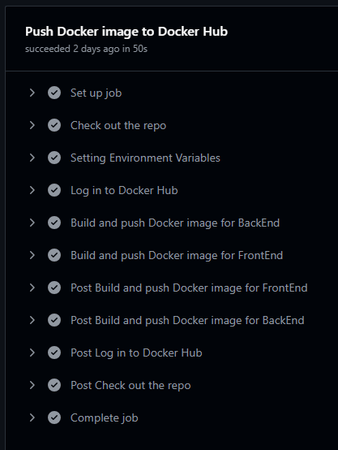
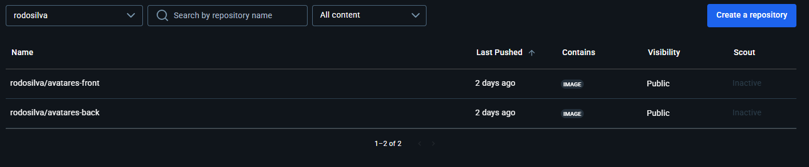

+++
date = '2025-01-16T14:09:17-05:00'
title = 'Código Facilito | BootCamp DevOps | Proyecto Final | Avatares'
+++

## Objetivos
- Aplicar los conocimientos adquiridos durante el
Bootcamp
- Iniciar o adicionar el proyecto a nuestro portafolio
- Desarrollar un proyecto que reflejen situaciones reales, nos
enfrentamos a desafíos auténticos, lo que nos prepara mejor para
el entorno laboral
- Podernos graduar del Bootcamp

## Información del Proyecto
- **Integrante**: Rodrigo Silva Alegría
- **Repositorio**: https://github.com/rodosilva/bootCampDevOps-ProyectoFinal-Avatares
- **Video Presentación**: 
> **_NOTA_**
> *Este proyecto utiliza como base la aplicación de `Rossana Suarez` la cual podremos encontrar en [gitlab](https://gitlab.com/training-devops-cf/avatares-devops)*

## Descripción
Este proyecto podría definirse en 4 fases.

**La primera fase** se basa en la construcción y ejecución de 2 contenedores. Uno de ellos con el backend (API) y el otro con el frontend (WEB). Todo orquestado con `Docker Compose`

La fase termina en cuanto se muestra el correcto funcionamiento de la aplicación desde el `http://localhost:5173`

**La segunda fase** se basa en la integración continua `CI`, lo que se traduce en el `push` de las imágenes hacia [Docker Hub](https://hub.docker.com/r/rodosilva/). Esto se logra gracias a los `jobs` de nuestro `Github Actions` 

**La tercera fase** se basa en la construcción de la infraestructura en `AWS`. La cual contendrá tanto el `VPC` como el cluster `EKS` (Kubernetes). Esto se logra utilizando `Terraform`

**La cuarta fase** se basa en la creación de los manifiestos de `Kubernetes` tales como los `deployments`, `configmaps` y `services` para el correcto funcionamiento de la aplicación pero esta vez alojada en `AWS`.

**La quinta fase** y fase final, se basa en la creación de los manifiestos necesarios para todo lo referente al monitoreo de la mano de `Prometheus` y `Grafana`

## Puesta en Marcha

### 1. Docker Compose: Despliegue local de la aplicación

En este directorio `backFront` se encuentra el único script que necesitamos ejecutar para poder correr la aplicación de `Avatares` de forma local dentro de contenedores (Usando `Docker Compose`).

El script `runCompose.sh` realizará los pasos necesarios para poner en marcha la aplicación.

#### Descripción de los Archivos
- `runCompose.sh`: Script que pone en marcha tanto el contenedor API (backend) como el WEB (frontend) usando Docker Compose.

- `.compose.env`: Archivo que contiene las variables como las variables de entorno el cual es llamando durante la ejecución mediante `source`

- `docker-compose.yaml`: Archivo con las instrucciones adecuadas para construir ambos contenedores junto a las condiciones necesarias para su comunicación y buen funcionamiento.

#### Requisitos
Para poder ejecutar vamos a necesitar:
- **Docker Compose**: Preferible v2.30.0
- **Docker**: Preferible version 27.2.1
- **Git**: Preferible version 2.43.0
- **Bash**: Terminal con Bash

#### Pasos
##### 1.1 Clonaremos el repositorio en una carpeta local
```bash
git clone https://github.com/rodosilva/bootCampDevOps-ProyectoFinal-Avatares.git
```
Para luego ingresar al directorio
```bash
cd bootCampDevOps-ProyectoFinal-Avatares/backFront/
```

##### 1.2 Ejecutaremos el script `runCompose.sh`
```bash
./runCompose.sh
```
Este script realiza básicamente 3 pasos. El primero tiene que ver con las variables de entorno, el segundo es ejecutar un par de scripts para crear las carpetas temporales `tempDir` y el tercero es correr el `Docker Compose`

##### 1.3 Disfrutar de la Aplicación
Desde el `localhost` ya nos será posible de visualizar la aplicación.
Tan solo necesitamos ir a la URL:

[Avatares](http://localhost:5173)


> **_Imagen 1_**:
> Aplicación `Avatares` corriendo de forma local. En la parte superior se logra ver 2 contenedores (backend y frontend) corriendo.

### 2. Github Actions: Push al container registry Docker Hub
Para que este procedimiento presente una forma de integración continua (CI), añadí un `job` a modo de `workflow`.
El cual puede encontrarse en `.github/workflows/pushDockerHub.yaml`

Dicho `Github actions` seguirá una serie de pasos apenas se realice un `push a main`

#### Pasos
##### 2.1 Push a main
Luego de realizar los commits que se vean convenientes, podremos ejecutar:
```bash
$ git push origin main
```
Automáticamente empezarán a correr los `steps` en donde encontramos:
- Autenticación co `Docker Hub`
- Obtención de las variables de entorno necesarias
- Y la construcción y envío de las imágenes


> **_Imagen 2_**: Job y steps del workflow (Github Actions)


> **_Imagen 3_**: Podemos ver las imágenes ya subidas al Docker Hub

### 3. Terraform: Infraestructura como código en AWS
En esta fase se construirá la infraestructura en AWS base para poder albergar nuestras imágenes y poder apreciar la aplicación `Avatares`

Nos ubicaremos en el directorio `./terraform-EKS/`

#### Descripción de Archivos
- `provider.tf`: En este archivo encontraremos los `locals` o variables que necesitaremos durante el proceso, como también el proveedor y región que en este caso será `AWS us-east-1`

- `vpc.tf`: Archivo encargado de dar las instrucciones para la construcción de la red o `VPC` que albergará y promoverá la comunicación entre los servicios.

- `eks.tf`: Archivo encargado de la construcción del cluster de `EKS` que viene a ser un `Kubernetes` desde `AWS`

#### Requisitos
- **Terraform**: Preferible v1.10.4
- **aws-cli**: Preferible versión 2.23.1

#### Pasos

##### 3.1 Configurando aws-cli y creando el rol EKS
El primer paso es obtener las claves de acceso del `IAM User`
También se pueden crear desde la consola de `AWS`

Cuando ya las tengamos deberemos añadirlas desde nuestra consola:
```bash
$ aws configure
AWS Access Key ID [****************]: 
AWS Secret Access Key [****************]:
Default region name [us-east-1]: 
Default output format [None]:
```

También deberemos colocar el ARN:
`arn:aws:iam::536697240563:role/avataresEksClusterRole` en el archivo `eks.tf`
Ese rol se debe crear desde la consola en `IAM - Roles` y elegir la opción `EKS CLuster`[¹]

[¹]: Para no incurrir en sobre costos, estoy usando un `Playground` de la plataforma de `KodeKloud`. Dicho sandbox se destruye luego de 3 horas y los permisos son limitados. Es por ellos de dicho `arn` ha sido temporal y a modo de ejemplo. Dado los permisos limitados, de aquí en adelante utilizaré un `EKS cluster` construido de forma manual siguiendo los alcances de `KodeKloud`

##### 3.2 Inicializando Terraform
Ahora toca inicializar el `Terraform`.
Esto hará que se descarguen todos los archivos necesarios para el funcionamiento del proveedor que en este caso es `AWS`
```bash
$ terraform init
```

##### 3.3 Planificando los cambios en la infraestructura
Luego de validar posibles errores de escritura o de indentación con
```bash
$ terraform validate
```
Podremos planificar los cambios que `Terraform` desea realizar
```bash
$ terraform plan
```

##### 3.4 Aplicando los cambios en la infraestructura
Finalmente nos preparamos para aplicar los cambios con
```bash
$ terraform apply
```
No olvidemos de destruir la infraestructura una vez hayamos terminado para evitar cobros adicionales
```bash
$ terraform destroy
```

### 4. Kubernetes Deployments: Despliegue de la aplicación


